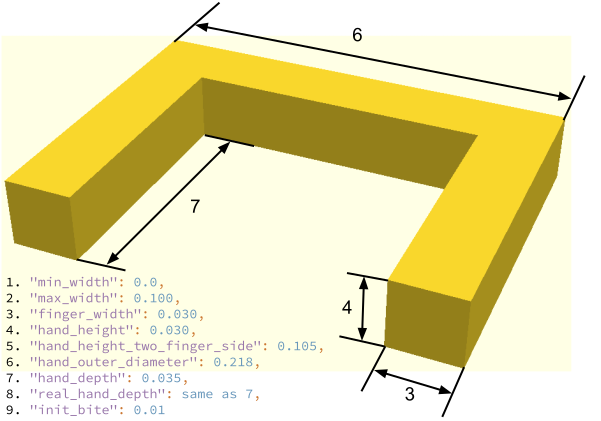

# PointNetGPD: Detecting Grasp Configurations from Point Sets
PointNetGPD (ICRA 2019, [arXiv](https://arxiv.org/abs/1809.06267)) is an end-to-end grasp evaluation model to address the challenging problem of localizing robot grasp configurations directly from the point cloud.

PointNetGPD is light-weighted and can directly process the 3D point cloud that locates within the gripper for grasp evaluation. Taking the raw point cloud as input, our proposed grasp evaluation network can capture the complex geometric structure of the contact area between the gripper and the object even if the point cloud is very sparse.

To further improve our proposed model, we generate a larger-scale grasp dataset with 350k real point cloud and grasps with the [YCB objects Dataset](http://ycb-benchmarks.s3-website-us-east-1.amazonaws.com/) for training.


## Video

[](https://www.youtube.com/watch?v=RBFFCLiWhRw)
## Before Install
All the code should be installed in the following directory:
```
mkdir -p $HOME/code/
cd $HOME/code/
```
## Install all the requirements (Using a virtual environment is recommended)
1. An example for create a virtual environment: `conda create -n pointnetgpd python=3.7 numpy ipython matplotlib`
1. `conda install mayavi -c conda-forge`
1. Make sure in your Python environment do not have same package named ```meshpy``` or ```dexnet```.
1. Install PyTorch: https://pytorch.org/get-started/locally/
1. Clone this repository:
    ```bash
    cd $HOME/code
    git clone https://github.com/lianghongzhuo/PointNetGPD.git
    ```

1. Install our requirements in `requirements.txt`
    ```bash
    cd $HOME/code/PointNetGPD
    pip install -r requirements.txt
    ```
1. Install our modified meshpy (Modify from [Berkeley Automation Lab: meshpy](https://github.com/BerkeleyAutomation/meshpy))
    ```bash
    cd $HOME/code/PointNetGPD/meshpy
    python setup.py develop
    ```

1. Install our modified dex-net (Modify from [Berkeley Automation Lab: dex-net](https://github.com/BerkeleyAutomation/dex-net))
    ```bash
    cd $HOME/code/PointNetGPD/dex-net
    python setup.py develop
    ```
1. Install visualization:
   ```
   cd $HOME/code/PointNetGPD/
   git clone https://github.com/lianghongzhuo/visualization.git
   cd visualization
   python setup.py develop
   ```
1. Modify the gripper configurations to your own gripper
    ```bash
    vim $HOME/code/PointNetGPD/dex-net/data/grippers/robotiq_85/params.json
    ```
    These parameters are used for dataset generation：
    ```bash
    "min_width":
    "force_limit":
    "max_width":
    "finger_radius":
    "max_depth":
    ```
    These parameters are used for grasp pose generation at experiment:
    ```bash
    "finger_width":
    "real_finger_width":
    "hand_height":
    "hand_height_two_finger_side":
    "hand_outer_diameter":
    "hand_depth":
    "real_hand_depth":
    "init_bite":
    ```


## Generated Grasp Dataset Download
You can download the dataset from: https://tams.informatik.uni-hamburg.de/research/datasets/PointNetGPD_grasps_dataset.zip

## Generate Your Own Grasp Dataset

1. Download YCB object set from [YCB Dataset](http://ycb-benchmarks.s3-website-us-east-1.amazonaws.com/).
A command line tool for download ycb dataset can be found at: [ycb-tools](https://github.com/lianghongzhuo/ycb-tools).
   ```bash
   cd $HOME/code/PointNetGPD/PointNetGPD/data
   git clone https://github.com/lianghongzhuo/ycb-tools
   cd ycb-tools
   python download_ycb_dataset.py rgbd_512
   ```
2. Manage your dataset at: `$HOME/code/PointNetGPD/PointNetGPD/data`
    Every object should have a folder, structure like this:
    ```
    ├002_master_chef_can
    |└── google_512k
    |    ├── nontextured.obj
    |    ├── nontextured.ply
    |    ├── nontextured.sdf (generated by SDFGen)
    |    ├── nontextured.stl
    |└── rgbd
    |    ├── *.jpg
    |    ├── *.h5
    |    ├── ...
    ├003_cracker_box
    └004_sugar_box
    ...
    ```
3. Install SDFGen from [GitHub](https://github.com/jeffmahler/SDFGen.git):
    ```bash
    git clone https://github.com/jeffmahler/SDFGen.git
    cd SDFGen
    mkdir build
    cd build
    cmake ..
    make
    ```
4. Install python pcl library [python-pcl](https://github.com/strawlab/python-pcl):
    ```bash
    git clone https://github.com/strawlab/python-pcl.git
    pip install --upgrade pip
    pip install cython
    pip install numpy
    cd python-pcl
    python setup.py build_ext -i
    python setup.py develop
    ```
    - If you use **ubuntu 18.04** and/or **conda environment**, you may encounter a compile error when install python-pcl, this is because conda has a higer version of vtk, here is a work around:
        - `conda install vtk` or `pip install vtk`
        - Use my fork: https://github.com/lianghongzhuo/python-pcl.git
5. Generate sdf file for each nontextured.obj file using SDFGen by running:
    ```bash
    cd $HOME/code/PointNetGPD/dex-net/apps
    python read_file_sdf.py
    ```
6. Generate dataset by running the code:
    ```bash
    cd $HOME/code/PointNetGPD/dex-net/apps
    python generate-dataset-canny.py [prefix]
    ```
    where `[prefix]` is optional, it will add a prefix on the generated files.

## Visualization tools
- Visualization grasps
    ```bash
    cd $HOME/code/PointNetGPD/dex-net/apps
    python read_grasps_from_file.py
    ```
    Note:
    - This file will visualize the grasps in `$HOME/code/PointNetGPD/PointNetGPD/data/ycb_grasp/` folder

- Visualization object normals
    ```bash
    cd $HOME/code/PointNetGPD/dex-net/apps
    python Cal_norm.py
    ```
This code will check the norm calculated by meshpy and pcl library.

## Training the network
1. Data prepare:
    ```bash
    cd $HOME/code/PointNetGPD/PointNetGPD/data
    ```

    Make sure you have the following files, The links to the dataset directory should add by yourself:
    ```
    ├── google2cloud.csv  (Transform from google_ycb model to ycb_rgbd model)
    ├── google2cloud.pkl  (Transform from google_ycb model to ycb_rgbd model)
    ├── ycb_grasp  (generated grasps)
    └── ycb_tools  (YCB dataset from https://github.com/lianghongzhuo/ycb-tools.git)
    ```

    Generate point cloud from rgb-d image, you may change the number of process running in parallel if you use a shared host with others
    ```bash
    cd $HOME/code/PointNetGPD/PointNetGPD
    python ycb_cloud_generate.py
    ```
    Note: Estimated running time at our `Intel(R) Xeon(R) CPU E5-2690 v4 @ 2.60GHz` dual CPU with 56 Threads is 36 hours. Please also remove objects beyond the capacity of the gripper.

1. Run the experiments:
    ```bash
    cd PointNetGPD
    ```

    Launch a tensorboard for monitoring
    ```bash
    tensorboard --log-dir ./assets/log --port 8080
    ```

    and run an experiment for 200 epoch
    ```
    python main_1v.py --epoch 200 --mode train --batch-size x (x>1)
    ```

    File name and corresponding experiment:
    ```
    main_1v.py        --- 1-viewed point cloud, 2 class
    main_1v_mc.py     --- 1-viewed point cloud, 3 class
    main_1v_gpd.py    --- 1-viewed point cloud, GPD
    main_fullv.py     --- Full point cloud, 2 class
    main_fullv_mc.py  --- Full point cloud, 3 class
    main_fullv_gpd.py --- Full point cloud, GPD
    ```

    For GPD experiments, you may change the input channel number by modifying `input_chann` in the experiment scripts(only 3 and 12 channels are available)

## Using the trained network

1. Get UR5 robot state:

    Goal of this step is to publish a ROS parameter tell the environment whether the UR5 robot is at home position or not.
    ```
    cd $HOME/code/PointNetGPD/dex-net/apps
    python get_ur5_robot_state.py
    ```
2. Run perception code:
    This code will take depth camera ROS info as input, and gives a set of good grasp candidates as output.
    All the input, output messages are using ROS messages.
    ```
    cd $HOME/code/PointNetGPD/dex-net/apps
    python kinect2grasp.py

    arguments:
    -h, --help                 show this help message and exit
    --cuda                     using cuda for get the network result
    --gpu GPU                  set GPU number
    --load-model LOAD_MODEL    set witch model you want to use (rewrite by model_type, do not use this arg)
    --show_final_grasp         show final grasp using mayavi, only for debug, not working on multi processing
    --tray_grasp               not finished grasp type
    --using_mp                 using multi processing to sample grasps
    --model_type MODEL_TYPE    selet a model type from 3 existing models
    ```

## Citation
If you found PointNetGPD useful in your research, please consider citing:

```plain
@inproceedings{liang2019pointnetgpd,
  title={{PointNetGPD}: Detecting Grasp Configurations from Point Sets},
  author={Liang, Hongzhuo and Ma, Xiaojian and Li, Shuang and G{\"o}rner, Michael and Tang, Song and Fang, Bin and Sun, Fuchun and Zhang, Jianwei},
  booktitle={IEEE International Conference on Robotics and Automation (ICRA)},
  year={2019}
}
```

## Acknowledgement
- [gpg](https://github.com/atenpas/gpg)
- [gpd](https://github.com/atenpas/gpd)
- [dex-net](https://github.com/BerkeleyAutomation/dex-net)
- [meshpy](https://github.com/BerkeleyAutomation/meshpy)
- [SDFGen](https://github.com/christopherbatty/SDFGen)
- [pyntcloud](https://github.com/daavoo/pyntcloud)
- [metu-ros-pkg](https://github.com/kadiru/metu-ros-pkg)
- [mayavi](https://github.com/enthought/mayavi)

